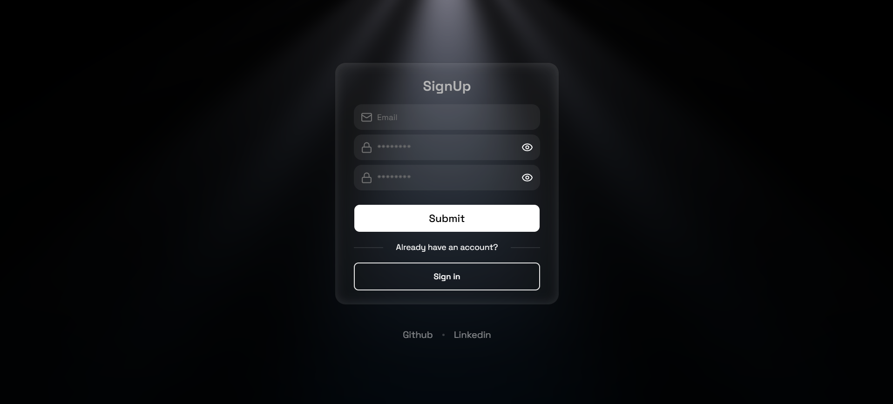
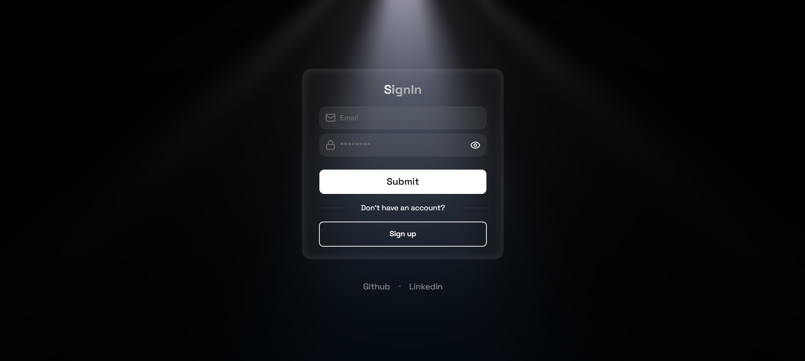

# Fullstack Auth

A full-stack authentication system with a dark-themed, minimal UI, built with Next.js and TypeScript, BetterAuth for auth, Prisma and SQLite for the database, and Zod for validation.

> 🚧 **Status:** In progress — UI for Sign In / Sign Up is complete. Backend integration (BetterAuth + Prisma) is in progress.

## Screenshots

### Sign Up



### Sign In



## Features

- [x] Sign Up UI with form validation
- [x] Sign In UI with form validation
- [x] Client-side validation with React Hook Form + Zod
- [ ] Email/Password authentication (BetterAuth)
- [ ] Prisma + SQLite database integration
- [ ] Session management (BetterAuth cookie handling)
- [ ] Protected `/profile` route (redirects to `/sign-in` if not authenticated)

## Tech Stack

| Category       | Technology                                      |
| -------------- | ----------------------------------------------- |
| Framework      | [Next.js](https://nextjs.org/) (App Router)     |
| Language       | TypeScript                                      |
| Authentication | [BetterAuth](https://www.better-auth.com/)      |
| ORM / Database | [Prisma](https://www.prisma.io/) + SQLite       |
| Form Handling  | [React Hook Form](https://react-hook-form.com/) |
| Validation     | [Zod](https://zod.dev/)                         |
| UI Components  | [shadcn/ui](https://ui.shadcn.com/)             |
| Styling        | [Tailwind CSS](https://tailwindcss.com/)        |

## Getting Started

### Prerequisites

- Node.js 18+
- npm

### Installation

```bash
git clone https://github.com/boydsv/fullstack-auth.git
cd fullstack-auth
npm install
```

### Run the development server

```bash
npm run dev
```

Open [http://localhost:3000](http://localhost:3000) in your browser.
